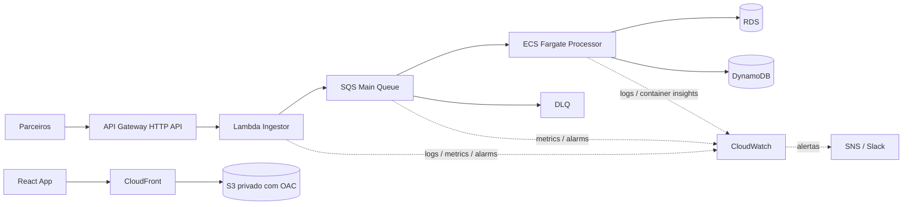

# Arquitetura FinData Flow

## Modelo de computacao

- API de ingestao em Lambda, com API Gateway HTTP API, para manter escalabilidade automatica e custo baixo em ociosidade.
- Processamento em lote em ECS Fargate, porque o trabalho pode durar de 10 a 40 minutos e nao pode depender do timeout da Lambda.

## Orquestracao e gatilhos

- A API valida a entrada e publica a transacao na fila SQS.
- O worker em ECS consome a fila, processa em background e usa DLQ para mensagens que excedem a politica de reprocessamento.
- Essa separacao evita perda de mensagens e desacopla a ingestao do processamento pesado.

## Persistencia de dados

- Dados sensiveis ficam em banco relacional com credenciais via secret manager/secret ARN.
- Estado de processamento em grande escala fica em DynamoDB quando necessario para rastreio e auditoria.
- Logs tecnicos ficam em CloudWatch Logs com retencao por ambiente.

## Observabilidade

- CloudWatch Metrics e Metric Alarms monitoram P99 da Lambda, mensagens na DLQ e sinais operacionais do ECS.
- CloudWatch Logs centraliza logs da Lambda e do ECS.
- Container Insights ajuda a acompanhar saude do cluster e tarefas.
- Os alarmes podem notificar via SNS e integrar com Slack.

## IaC e ambientes

- O repositorio separa bootstrap, modulos e ambientes.
- Cada ambiente tem backend e variaveis proprias para manter paridade com isolamento de state.

## CI/CD e rollback

- O plan valida PRs antes da promocao.
- O apply faz deploy sequencial entre ambientes.
- O deploy de producao usa canary e permite rollback rapido da versao do alias Lambda.
