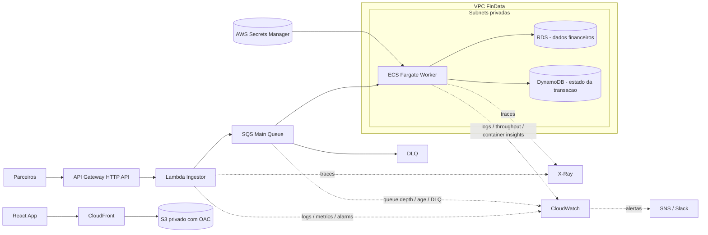

# Arquitetura FinData Flow

## A.1 Modelo de Computacao

- API de ingestao em Lambda com API Gateway HTTP API para manter escalabilidade automatica e custo baixo em ociosidade.
- SLO da API: 150ms em P99, com alarmes em 130ms para margem operacional.
- Em producao, provisioned concurrency no alias `stable` para reduzir impacto de cold start no caminho sincrono.
- Processamento em lote em ECS Fargate para suportar execucoes de 10 a 40 minutos sem limite de timeout da Lambda.

## A.2 Orquestracao e Gatilhos

- A API valida a entrada e so retorna `202` apos `SendMessage` confirmado no SQS.
- SQS main queue desacopla ingestao do processamento pesado; a visibilidade e de 45 minutos, acima do pior lote esperado (40 minutos).
- `maxReceiveCount` com redrive para DLQ evita loop infinito de retries; DLQ com alarme de profundidade (`>0`) para acao operacional.
- Como SQS standard e at-least-once, o worker precisa ser idempotente.
- Idempotencia por chave de deduplicacao `transaction_id`, persistindo estado por item no DynamoDB antes de efeitos colaterais.

## A.3 Persistencia de Dados

- RDS para dados financeiros com garantias ACID, adequado para reconciliacao e consistencia transacional.
- Dados e credenciais protegidos com KMS/Secrets Manager; banco em subnets privadas.
- Security Group do RDS restrito ao Security Group do ECS worker.
- DynamoDB para estado por transacao com modelo minimo:
  - `PK = transaction_id`
  - `status` (received, processing, done, failed)
  - `ttl` para limpeza automatica de estados expirados
- Esse estado viabiliza idempotencia, auditoria e retomada de processamento.

## A.4 Observabilidade

- Monitoramento em tempo real:
  - queue depth (mensagens visiveis)
  - oldest message age
  - DLQ > 0
  - latencia P99 e error rate da Lambda
  - metricas custom de throughput do worker (itens processados/min, falhas/min)
- Rastrear um registro entre milhares:
  - `transaction_id` como correlation ID propagado API -> SQS -> worker
  - logs JSON estruturados em Lambda e ECS contendo `transaction_id`, `status`, `step`, `error_code`
  - consulta no CloudWatch Logs Insights filtrando por `transaction_id`
  - estado do item no DynamoDB para saber ultimo status persistido
- Tracing distribuido com X-Ray (Lambda com tracing ativo) para diagnostico de latencia e falhas entre servicos.

## IaC e ambientes

- O repositorio separa bootstrap, modulos e ambientes.
- Cada ambiente tem backend e variaveis proprias para manter paridade com isolamento de state.

## CI/CD e rollback

- O plan valida PRs antes da promocao.
- O apply faz deploy sequencial entre ambientes.
- O deploy de producao usa CodeDeploy canary (10%/15min) e rollback automatico por alarmes CloudWatch.
- Em incidente, o rollback manual de emergencia usa `aws lambda update-alias` direto para retorno imediato da versao `stable`.
- O smoke test apos promocao e uma verificacao final do endpoint; o auto-rollback ja foi decidido na etapa de canary com trafego real.
